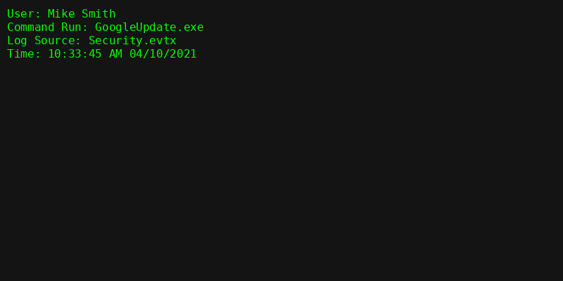
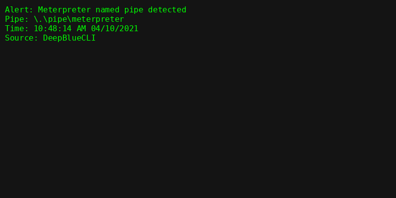
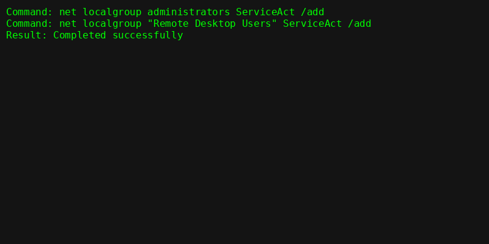

[](https://github.com/adrianbooker95/DeepBlueCLI-Investigation)

# 🔍 DeepBlueCLI Incident Response Investigation

This is a fork-inspired project based on the [SANS DeepBlueCLI](https://github.com/sans-blue-team/DeepBlueCLI) tool. I’ve enhanced it to include a full hands-on **investigation report**, screenshots of evidence, and threat detection based on Windows EVTX logs.

---

## 🧰 Tools Used

- **DeepBlueCLI** – PowerShell log parser for blue teams  
- **Windows Event Viewer**  
- Optional: **Timeline Explorer**, Notepad++, MITRE ATT&CK  

---

## 📁 Folder Structure

```
DeepBlueCLI-Investigation/
├── evtx/               → Log samples (Security.evtx, System.evtx)
├── screenshots/        → CLI output, Event Viewer screenshots
├── REPORT.md           → Full investigation write-up
└── README.md           → Project overview (this file)
```

---

## 📝 Investigation Summary

This investigation focused on analyzing RDP compromise and Meterpreter activity using DeepBlueCLI.

- ✅ Identified user who ran malicious executable  
- 🔎 Detected Meterpreter named pipe behavior  
- 🛠 Found service creation and new user persistence  
- 📎 Linked techniques to MITRE ATT&CK  
- 📸 Documented all findings with screenshots  

➡️ **Full report here**: [REPORT.md](REPORT.md)

---

## 📸 Sample Screenshots

  
*User Mike Smith initiated suspicious process.*

  
*Meterpreter pipe identified in EVTX logs.*

  
*Persistence via group membership detected.*

---

## 📺 Video Walk-through

Want to see the full investigation in action?  
Watch this Deep Blue lab walkthrough on YouTube:  
🎥 [Solving The "Deep Blue" Investigation Lab!](https://www.youtube.com/watch?v=3FwH033NJxg)

---

## 🧠 What I Learned

- How to parse EVTX logs with CLI tools  
- How to identify persistence, privilege escalation, and post-exploitation activity  
- How to structure investigation evidence in a professional format  

---

## 🛡 MITRE ATT&CK Techniques Detected

| Technique ID | Name                  |
|--------------|-----------------------|
| T1098        | Account Manipulation  |
| T1110.003    | Password Spraying     |

---

## 💼 About This Project

This repository is part of my **cybersecurity portfolio** to showcase practical incident response, threat hunting, and log analysis skills.

Feel free to explore or reach out with questions or feedback!
