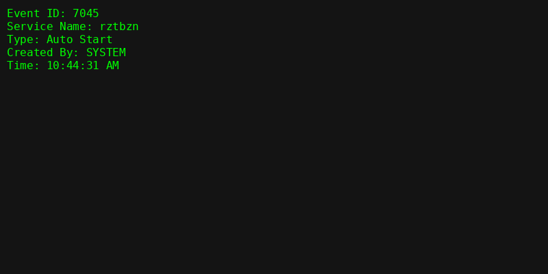
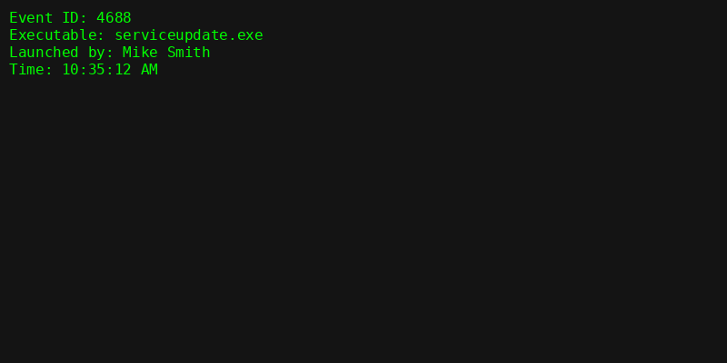
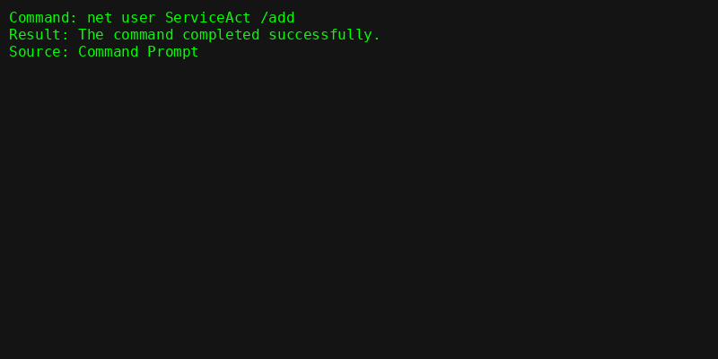
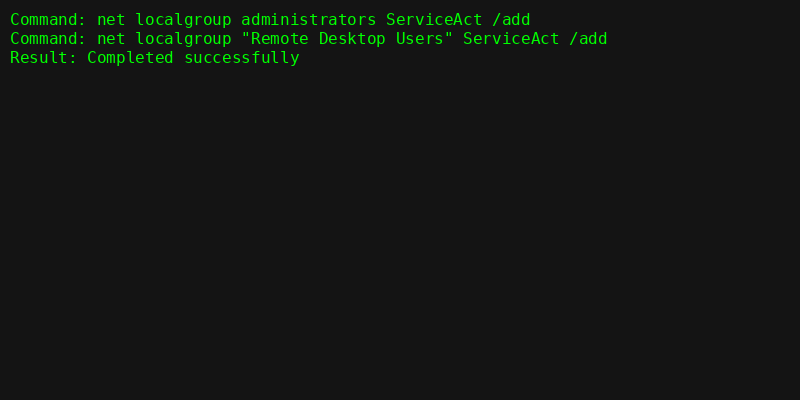

# 📝 DeepBlueCLI Investigation Report

This report documents step-by-step analysis of Windows event logs using DeepBlueCLI. Screenshots and evidence are provided for each detection point.

---

## 1. Who ran GoogleUpdate.exe?
- **User**: Mike Smith
- **Tool Used**: DeepBlueCLI
- **Command**:
  ```powershell
  .\DeepBlue.ps1 .\evtx\Security.evtx
  ```
- **Screenshot**:  
  

---

## 2. Meterpreter activity timestamp
- **Time**: 2021-04-10 10:48:14
- **Screenshot**:  
  

---

## 3. Suspicious service created
- **Service name**: rztbzn
- **Log source**: System.evtx
- **Screenshot**:  
  

---

## 4. Malicious payload name
- **Executable**: serviceupdate.exe
- **Discovered via**: Event ID 4688
- **Screenshot**:  
  

---

## 5. Account created for persistence
- **Command**:
  ```text
  net user ServiceAct /add
  ```
- **Screenshot**:  
  

---

## 6. Group memberships
- Added to:
  - Administrators
  - Remote Desktop Users
- **Screenshot**:  
  

---

## 🎯 Summary of Findings

| Step | Finding | Evidence |
|------|---------|----------|
| 1 | GoogleUpdate.exe run by Mike Smith | Screenshot |
| 2 | Meterpreter detected | Screenshot |
| 3 | rztbzn service | Screenshot |
| 4 | Malicious payload | Screenshot |
| 5 | ServiceAct account | Screenshot |
| 6 | Group memberships | Screenshot |

---

## 📌 MITRE ATT&CK Mapping
- **T1098** – Account Manipulation  
- **T1110.003** – Password Spraying
